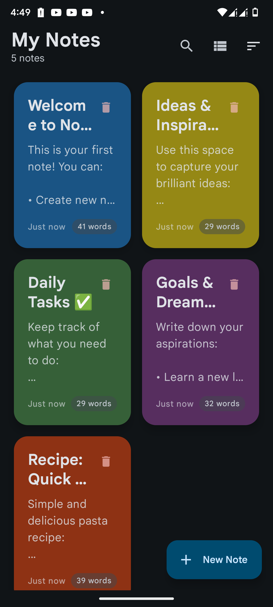
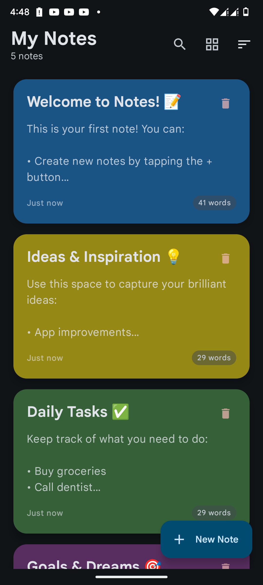
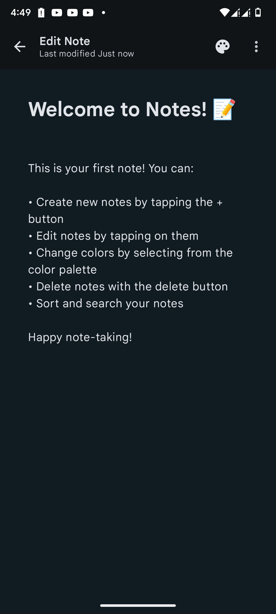
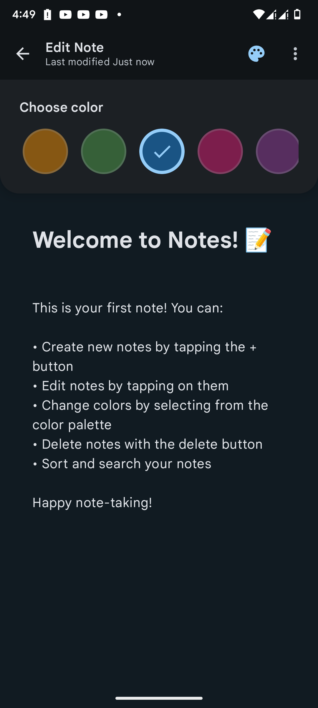
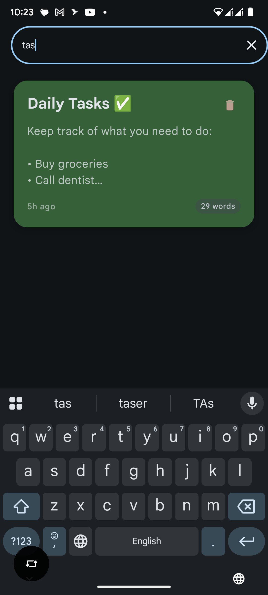
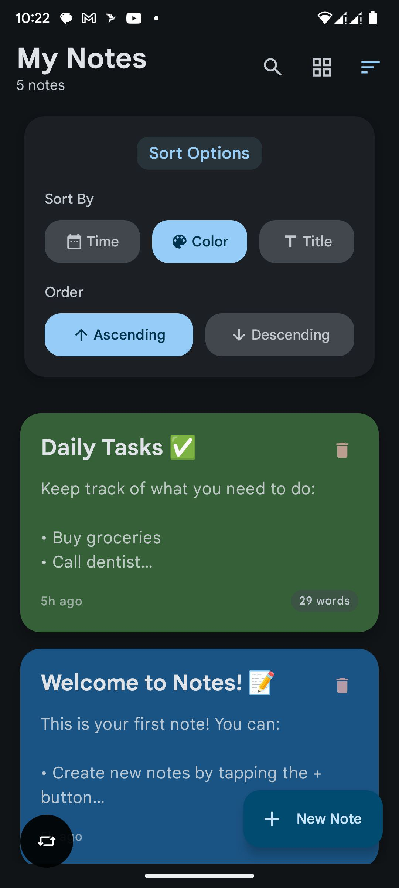
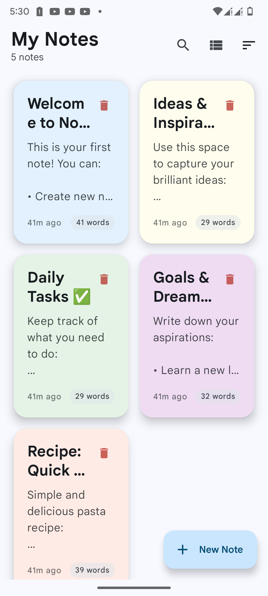

# Notes App 📝

A modern, feature-rich notes application built with the latest Android development technologies, showcasing clean
architecture principles and modern UI design patterns.

## 📱 Screenshots

### Main Interface Views
| Grid View                               | List View                               | Note Editor                                 |
|-----------------------------------------|-----------------------------------------|---------------------------------------------|
|  |  |  |

### Customization & Features
| Color Selection                                     | Search Functionality              | Sort Options                  | Light Theme                                 |
|-----------------------------------------------------|-----------------------------------|-------------------------------|---------------------------------------------|
|  |  |  |  |

## 🚀 Features

### Core Functionality

- ✅ **Create & Edit Notes** - Rich text note creation with instant saving
- 🎨 **Color Themes** - 10 beautiful color themes for note organization
- 🔍 **Smart Search** - Search through note titles and content
- 📊 **Flexible Sorting** - Sort by date, title, or color
- 🗑️ **Undo Delete** - Accidental deletion protection with undo functionality
- 📱 **Responsive UI** - Grid and list view modes
- 🌙 **Dark Mode Support** - Automatic theme adaptation

### User Experience

- ⚡ **Instant Response** - Real-time updates and smooth transitions
- 💾 **Auto-save** - Never lose your notes with automatic persistence
- 🎯 **Intuitive Navigation** - Clean, material design interface
- 📋 **Sample Content** - Pre-populated with helpful sample notes
- 🔄 **State Preservation** - Maintains app state across configuration changes

## 🏗️ Architecture & Design Patterns

### Architecture Overview

This application follows **Clean Architecture** principles with clear separation of concerns:

```
┌─────────────────────────────────────────────────┐
│                 Presentation Layer               │
│  ┌─────────────────┐  ┌─────────────────────────┐ │
│  │   UI Screens    │  │     ViewModels          │ │
│  │  (Composables)  │  │  (Business Logic)       │ │
│  └─────────────────┘  └─────────────────────────┘ │
└─────────────────────────────────────────────────┘
┌───────────────────────────────────────────────────┐
│                 Domain Layer                      │
│  ┌─────────────────┐  ┌─────────────────────────┐ │
│  │   Use Cases     │  │     Entities            │ │
│  │ (Business Rules)│  │  (Core Models)          │ │
│  └─────────────────┘  └─────────────────────────┘ │
└───────────────────────────────────────────────────┘
┌─────────────────────────────────────────────────┐
│                  Data Layer                      │
│  ┌─────────────────┐  ┌─────────────────────────┐ │
│  │  Repositories   │  │    Data Sources         │ │
│  │ (Abstractions)  │  │ (Room DB, DataStore)    │ │
│  └─────────────────┘  └─────────────────────────┘ │
└─────────────────────────────────────────────────┘
```

### Design Patterns Implemented

- **MVVM (Model-View-ViewModel)** - Clear separation between UI and business logic
- **Repository Pattern** - Abstraction layer for data access
- **Use Case Pattern** - Encapsulation of business rules
- **Dependency Injection** - Loose coupling using Koin
- **Observer Pattern** - Reactive UI updates with StateFlow
- **Factory Pattern** - ViewModel creation with parameters

## 🛠️ Technology Stack

### Core Android Technologies

- **Kotlin** - Primary programming language
- **Jetpack Compose** - Modern declarative UI framework
- **Material Design 3** - Latest Material Design system
- **Android Architecture Components** - Lifecycle-aware components

### Data & Persistence

- **Room Database** - Local SQLite database with type-safe queries
- **DataStore** - Modern preference storage solution
- **Kotlinx Serialization** - Type-safe serialization for data persistence
- **Flow & Coroutines** - Reactive data streams and asynchronous programming

### Navigation & State Management

- **Navigation 3** - Type-safe navigation with Kotlin Serialization
- **ViewModel** - UI-related data holder with lifecycle awareness
- **SavedStateHandle** - Process death survival for UI state
- **Compose State** - Local UI state management

### Dependency Injection & Architecture

- **Koin** - Lightweight dependency injection framework
- **KSP (Kotlin Symbol Processing)** - Efficient annotation processing
- **Kotlin Reflection** - Runtime type introspection

### UI & User Experience

- **Material Icons Extended** - Comprehensive icon library
- **Custom Color System** - Dynamic theming with 10 color variants
- **Responsive Design** - Adaptive layouts for different screen sizes
- **State Preservation** - Seamless configuration change handling

### Development & Build Tools

- **Gradle Kotlin DSL** - Type-safe build configuration
- **Version Catalogs** - Centralized dependency management
- **ProGuard** - Code obfuscation and optimization

## 📁 Project Structure

```
src/main/java/com/example/notes/
├── data/                           # Data Layer
│   ├── data_source/               # Local data sources
│   │   ├── NoteDao.kt            # Room DAO interface
│   │   └── NoteDatabase.kt       # Room database configuration
│   └── repository/               # Repository implementations
│       └── NoteRepositoryImpl.kt # Concrete repository
├── domain/                        # Domain Layer
│   ├── model/                    # Core business models
│   │   └── Note.kt              # Note entity with Room annotations
│   ├── repository/              # Repository abstractions
│   │   └── NoteRepository.kt    # Repository interface
│   ├── use_case/               # Business logic use cases
│   │   ├── NoteUseCases.kt     # Note-related business operations
│   │   └── AppInitializer.kt   # App initialization logic
│   └── utils/                  # Domain utilities
│       └── SortPreference.kt   # Sorting logic and preferences
├── ui/                          # Presentation Layer
│   ├── components/             # Reusable UI components
│   ├── screen/                # Feature screens
│   │   ├── all_notes/         # Notes list screen
│   │   └── single_note/       # Note editor screen
│   └── theme/                 # UI theming
│       ├── Color.kt          # Color definitions
│       ├── Theme.kt          # App theme configuration
│       └── NoteColor.kt      # Note-specific color system
├── nav3/                      # Navigation Layer
│   ├── NavigationRoot.kt     # Navigation graph
│   └── Page.kt              # Type-safe navigation destinations
└── NoteApp.kt               # Application class with DI setup
```

## 🎯 Key Implementation Highlights

### 1. Type-Safe Navigation

```kotlin
sealed interface Page : NavKey {
    @Serializable
    data object NoteList : Page

    @Serializable
    data class SingleNote(val note: Note?) : Page

    @Serializable
    data class ConfirmationDelete(val note: Note) : Page
}
```

### 2. Reactive Data Flow

```kotlin
val notes: StateFlow<List<Note>> = combine(
    sortPreference,
    repository.getAllNotes(),
    snapshotFlow { searchText }
) { order, notesList, text ->
    // Filter and sort logic
}.stateIn(viewModelScope, WhileSubscribed(5000), emptyList())
```

### 3. Clean Repository Pattern

```kotlin
interface NoteRepository {
    fun getAllNotes(): Flow<List<Note>>
    suspend fun upsertNote(note: Note)
    suspend fun deleteNote(note: Note)
    suspend fun getNote(id: Int): Note?
}
```

### 4. Dependency Injection with Koin

```kotlin
val appModule = module {
    single { NoteDatabase.getInstance(androidContext()) }
    single { get<NoteDatabase>().noteDao }
    singleOf(::NoteRepositoryImpl) { bind<NoteRepository>() }
    singleOf(::NoteUseCases)
    viewModelOf(::AllNotesScreenViewModel)
}
```

## 🎨 Design System

### Color Palette

The app features a comprehensive color system with 10 distinct themes:

- **Vanilla, Mint, Sky, Blush, Lavender**
- **Lemon, Aqua, Peach, Violet, Ocean**

Each color automatically adapts to light/dark themes with proper contrast ratios.

### Material Design 3

- Dynamic theming support
- Responsive typography scale
- Elevation and shadow system
- Adaptive color schemes

## 🚦 Getting Started

### Prerequisites

- Kotlin 2.2.0
- JDK 17 or higher
- Android SDK API 34

### Installation

1. Clone the repository
2. Open in Android Studio
3. Sync project with Gradle files
4. Run on device or emulator

### Build Variants

- **Debug** - Development build with debugging enabled
- **Release** - Production build with optimizations

## 📊 Performance Considerations

### Database Optimization

- **Indexed Queries** - Efficient search operations
- **Coroutine Context** - IO operations on background threads
- **Flow-based Queries** - Reactive database updates

### UI Performance

- **Lazy Layouts** - Efficient list rendering
- **State Hoisting** - Optimized recomposition
- **Remember & LaunchedEffect** - Proper Compose lifecycle management

### Memory Management

- **ViewModel Scope** - Proper coroutine lifecycle
- **StateFlow** - Memory-efficient state observation
- **Saved State** - Process death recovery

## 🧪 Testing Strategy

### Unit Testing

- Repository pattern testing
- Use case validation
- ViewModel business logic testing

### UI Testing

- Compose UI testing
- Navigation flow testing
- User interaction validation

## 🔮 Future Enhancements

### Planned Features

- 📂 **Folders & Categories** - Organize notes into folders
- 🔄 **Cloud Sync** - Multi-device synchronization
- 🔐 **Encryption** - End-to-end note encryption
- 📎 **Attachments** - Image and file attachments
- 🎙️ **Voice Notes** - Audio recording capabilities
- 📤 **Export Options** - PDF, text, and other formats
- 🌐 **Web Version** - Cross-platform accessibility

### Technical Improvements

- **Offline-first Architecture** - Enhanced offline capabilities
- **Performance Optimization** - Further UI and database optimizations
- **Accessibility** - Enhanced accessibility features
- **Localization** - Multi-language support

## 📄 License

This project is developed as a portfolio showcase demonstrating modern Android development practices and clean
architecture implementation.

---

## 👨‍💻 About the Developer

This application demonstrates proficiency in:

- **Modern Android Development** with Jetpack Compose
- **Clean Architecture** and SOLID principles
- **Reactive Programming** with Coroutines and Flow
- **Database Design** with Room persistence library
- **Dependency Injection** and modular design
- **Material Design** implementation
- **Performance Optimization** and best practices

*Built with ❤️ using the latest Android technologies*
